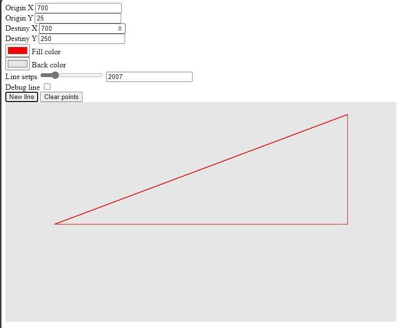

# SOBRE ESTE PROGRAMA
[English version](./readmeUS.md)  
Esta simples ferramenta para desenhar retas em um canvas foi escrito utilizano JS para manipular o contexto 2D de um elemento HTML.    
A equação utilizada para criar uma reta foi escrita por mim, e se comporta como funções já existentes providas pelo próprio canvas.  
O objetivo deste código é por em prática os conceitos aprendidos durante a matéria de Geometria Analítica no curso de Engenharia Eletrônica.    
  

> Ao ativar 'Debug line' a reta é printada ao console.

# GEOMETRIA ANALÍTICA
  
UMA RETA PODE SER ESCRITA PELA EQUAÇÃO VETORIAL DA RETA USANDO OS CONCEITOS DE GEOMETRIA ANALÍTICA.  
  
PARA FORMAR UMA RETA É NECESSÁRIO:  
           
1- Um ponto e um Vetor diretor  
OU  
2- Dois pontos  
          
> Seja 'P' um ponto distinto de 'G' e 't' um escalar utilizado para segmentar a reta através do tempo.    
Definivmos o vetor diretor V como P em Direção à G, Logo (G - P)  
> Dando origem a equação:  
  
> (x, y) = p + t * v  
        
Isolando as coordenadas temos:  
           
> x = Px + t * Vx  
> y = Py + t * Vy          
